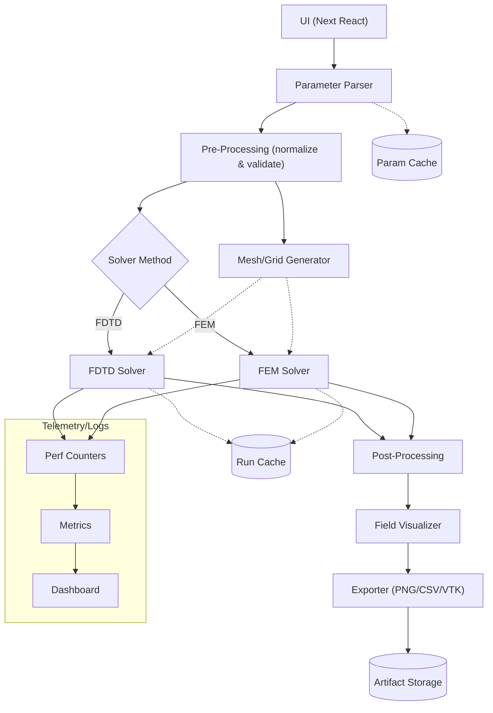
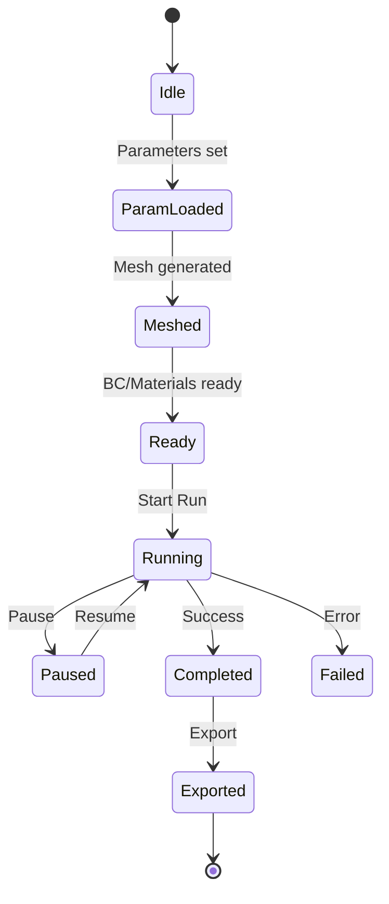
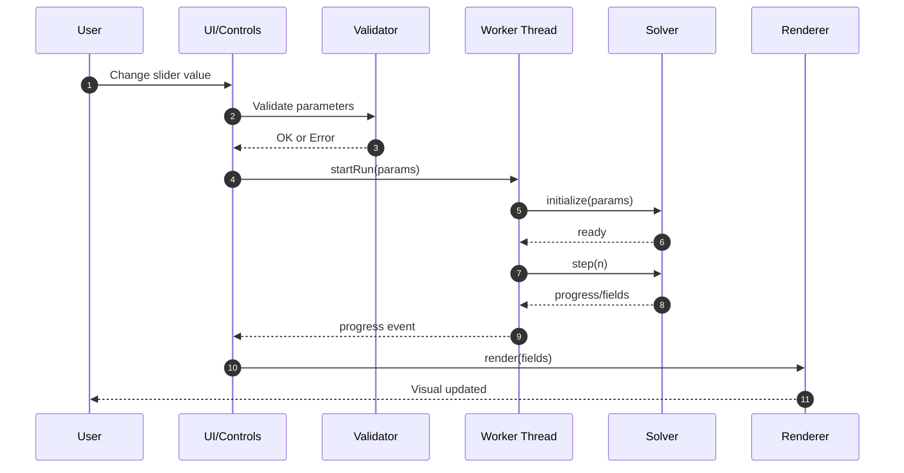
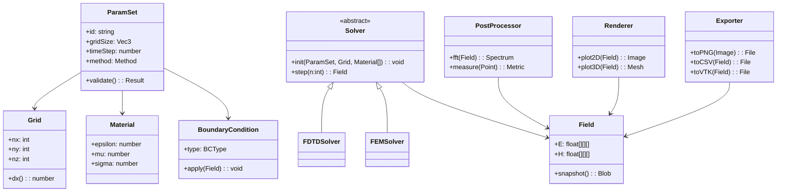
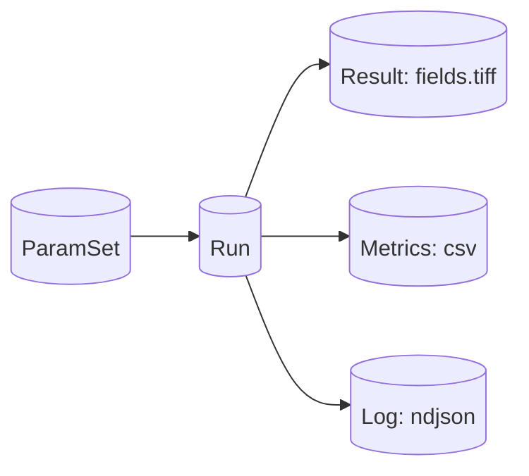
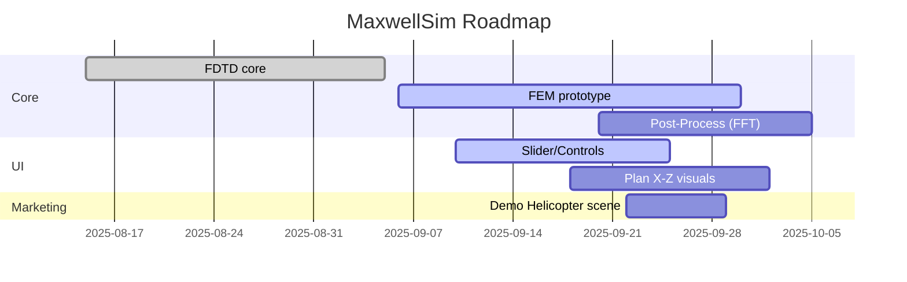
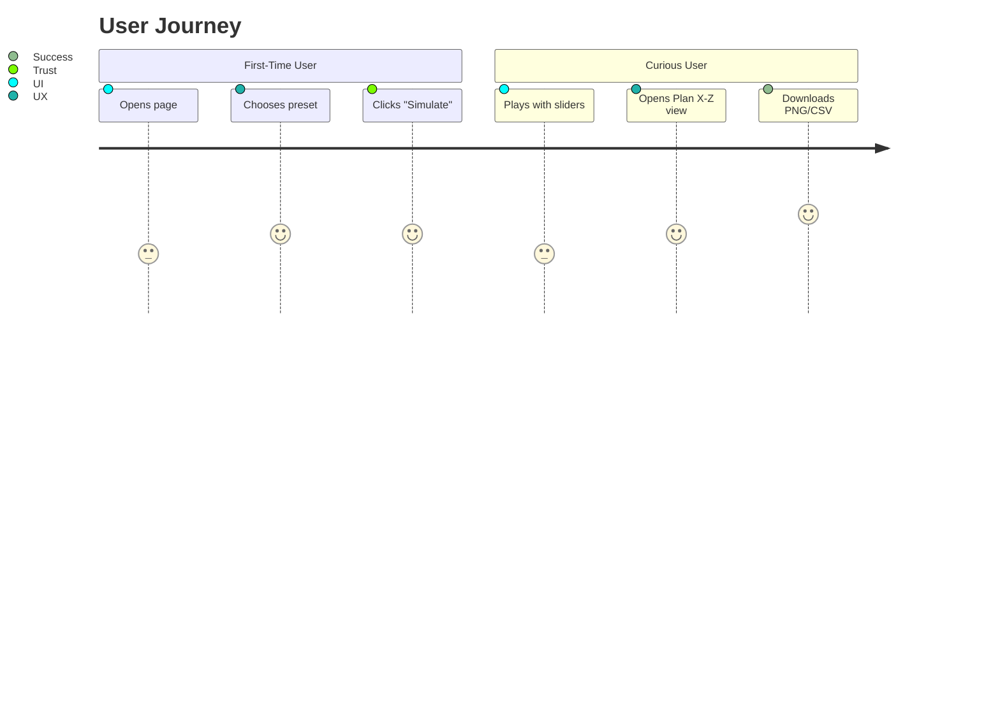
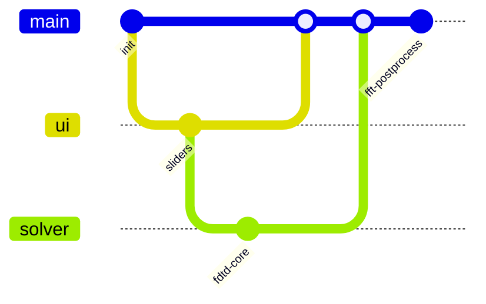

# MaxwellSim × Mermaid: Diagram Package

The following Mermaid diagrams are prepared to present MaxwellSim both to the technical team.

---

## 1) System Architecture — Flowchart

---

## 2) Simulation Lifecycle — State Diagram

---

## 3) UI Interaction — Sequence Diagram

---

## 4) Core Classes — Class Diagram

---

## 5) Data Model / Runs — Simple ER View

---

## 6) Roadmap — Gantt

---

## 7) User Journey — Journey Diagram

---

## 8) Git Workflow — GitGraph (Optional)

---

